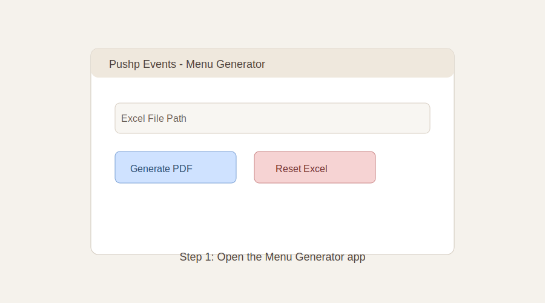
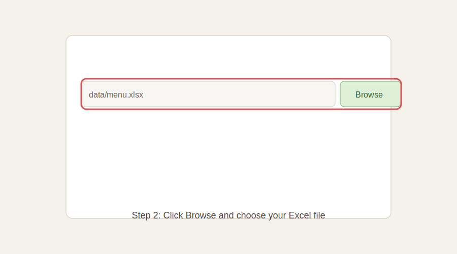
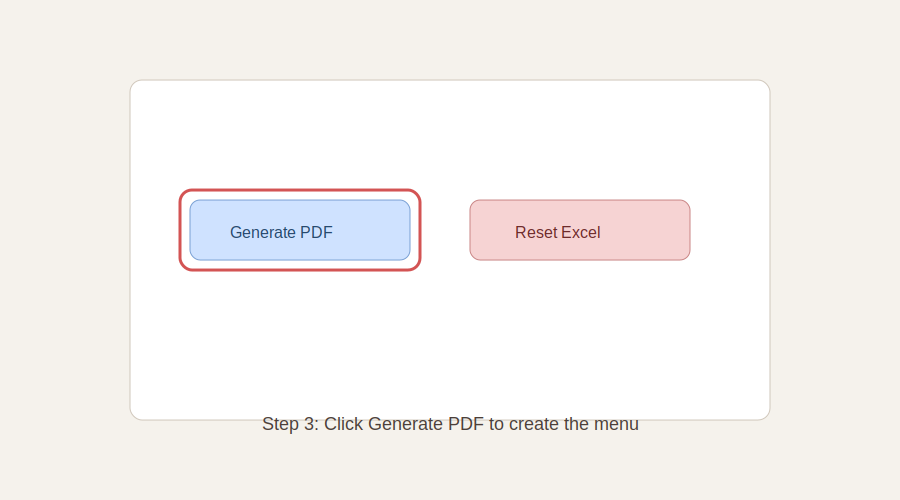
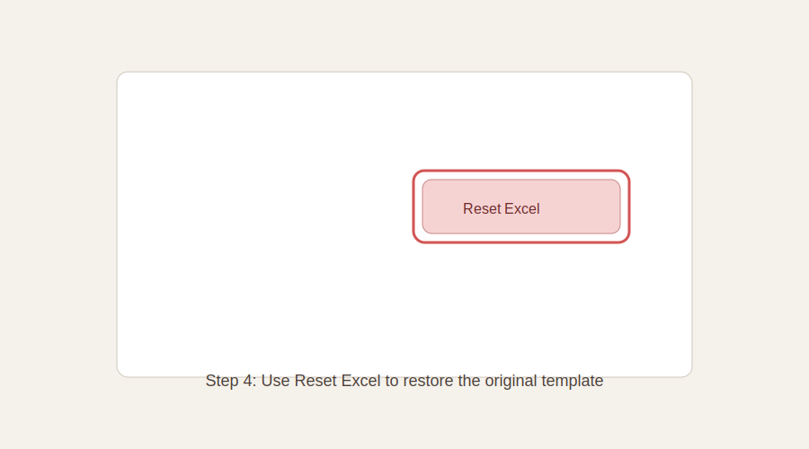

# Pushp Events Menu Generator - User Guide

## 1. Open the app

## 2. Choose the Excel file

## 3. Generate the PDF

## 4. Reset the Excel template (optional)

## Excel file structure
Your Excel file must contain 3 sheets:
- `event_info`
- `menu`
- `meal_counts`

### event_info
Required keys (column A) and values (column B):
- `event_name`
- `venue`
- `start_date`
- `end_date`
- `total_pax`
- `contact_phone` (or `caterer_phone`)
- `planner_name` (optional)
- `logo_path` (optional)

### menu
Columns:
- `date`
- `meal`
- `category`
- `item`

### meal_counts
Columns:
- `date`
- `meal`
- `count`

The `meal_counts` sheet auto-generates based on `start_date`, `end_date`, and `total_pax`.
If you edit the counts manually, the PDF will show your updated values.

## Reset behavior
When you click Reset, the app creates a fresh template copy in the same folder as your Excel file:
`<your_file>_reset.xlsx`

## Output
The generated PDF is saved to:
- `output/Pushp_Events_Menu.pdf`

If you choose a custom Excel file, the PDF is created in the same folder as the Excel file.
