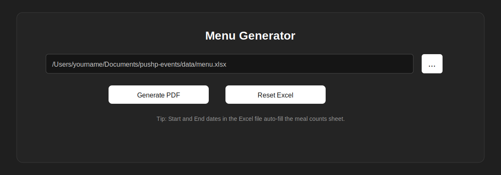
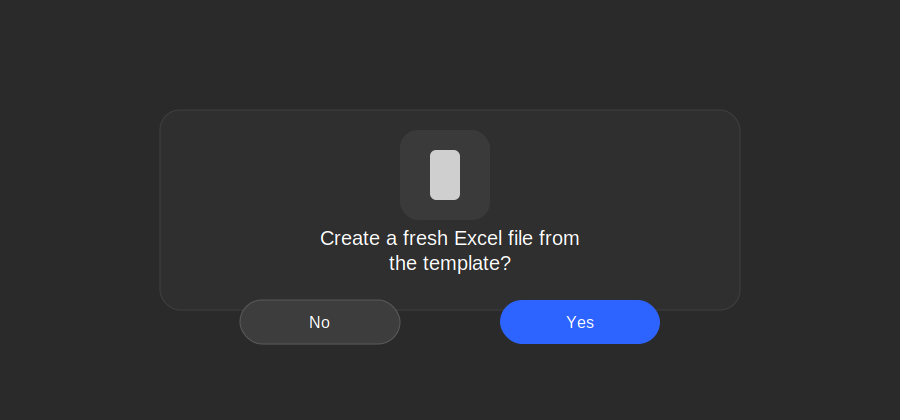
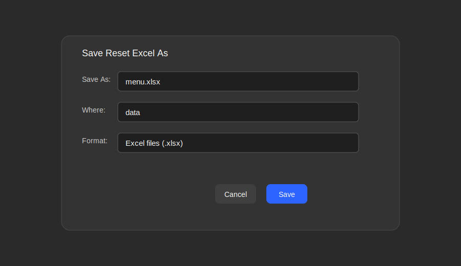

# Pushp Events Menu Generator - User Guide

## Overview
This app generates a professional multi-day menu PDF from an Excel file. It produces **two PDFs** for every run:
- **English** version
- **Hindi** version

When you generate, you choose where the **Generated-menu** folder should be saved.

## Windows Prerequisite
Before running `Pushp-Menu-Generator.exe` on Windows, install **GTK3 Runtime 64-bit**.

- Install GTK from the packaged ZIP/shared drive provided with the app.
- Recommended install path:
  `C:\Program Files\GTK3-Runtime Win64`
- If GTK is not installed, PDF generation can fail because WeasyPrint depends on GTK libraries.

---

## 1. Open the app and select the Excel file


- Click the **`...`** button to select your Excel file.
- The path appears in the text box.

---

## 2. Generate PDF (English + Hindi)
Click **Generate PDF**. The app will first ask you to **pick a folder** where the
**Generated-menu** directory should be created.

Then it will:
1. Read your Excel file
2. Build the menu grouped by **date → meal → category**
3. Produce **two PDFs**:
   - `<event_name>_English.pdf`
   - `<event_name>_Hindi.pdf`

The PDFs are saved in:
```
<your-selected-folder>/Generated-menu/<excel_filename>/
```

---

## 3. Reset Excel (create fresh template)
When you click **Reset Excel**, you’ll be asked to confirm:



If you choose **Yes**, you’ll be prompted to name the new file:



A **fresh Excel template** is created at the location you choose.

---

## Excel Structure
Your Excel file must have 3 sheets:
- `event_info`
- `menu`
- `meal_counts`

### event_info (Required Fields)
Column A = key, Column B = value

English keys:
- `event_name`
- `client_name`
- `venue`
- `start_date`
- `end_date`
- `total_pax` (auto-calculated)
- `contact_phone` (or `caterer_phone`)
- `caterer_name`
- `planner_name`
- `logo_path`

Hindi keys (optional for Hindi PDF):
- `event_name_hi`
- `client_name_hi`
- `venue_hi`
- `caterer_name_hi`
- `planner_name_hi`

If a Hindi key is missing, the Hindi PDF falls back to the English value.

### menu (Menu Items)
Columns:
- `date`
- `meal`
- `category`
- `item`

**Best practice:** Keep menu sheet clean and let it auto-fill dates & meal order after you set `start_date` and `end_date`.

### meal_counts (Auto Generated)
Columns:
- `date`
- `meal`
- `count`

Rules:
- Auto-filled from `start_date` → `end_date`
- Meal order always: **Breakfast → Lunch → Hi‑tea → Dinner**
- `count` is manual (enter per meal)

---

## Reset Logic (Important)
When you create a fresh Excel file using Reset:
- The **menu sheet is empty** except for formula-driven date & meal rows
- The **meal_counts sheet auto-generates** based on start/end dates
- `total_pax` is auto-calculated as the **sum** of all `meal_counts`

---

## Menu Generation Logic
- Each date is a separate page
- Meals are always shown in this order:
  **Breakfast → Lunch → Hi‑tea → Dinner**
- Counts are pulled from `meal_counts`
- Two PDFs are produced every time (English & Hindi)

---

## Output Files
All generated PDFs are organized like this:
```
<your-selected-folder>/
  Generated-menu/
    <excel_filename>/
      <event_name>_English.pdf
      <event_name>_Hindi.pdf
```

---

## Troubleshooting
- If meal_counts doesn’t fill, open the Excel file once so formulas recalculate, then save.
- If Hindi fields show English values, add the `_hi` keys in `event_info`.

---

If you want further customization (logo, fonts, layout), just tell me.
